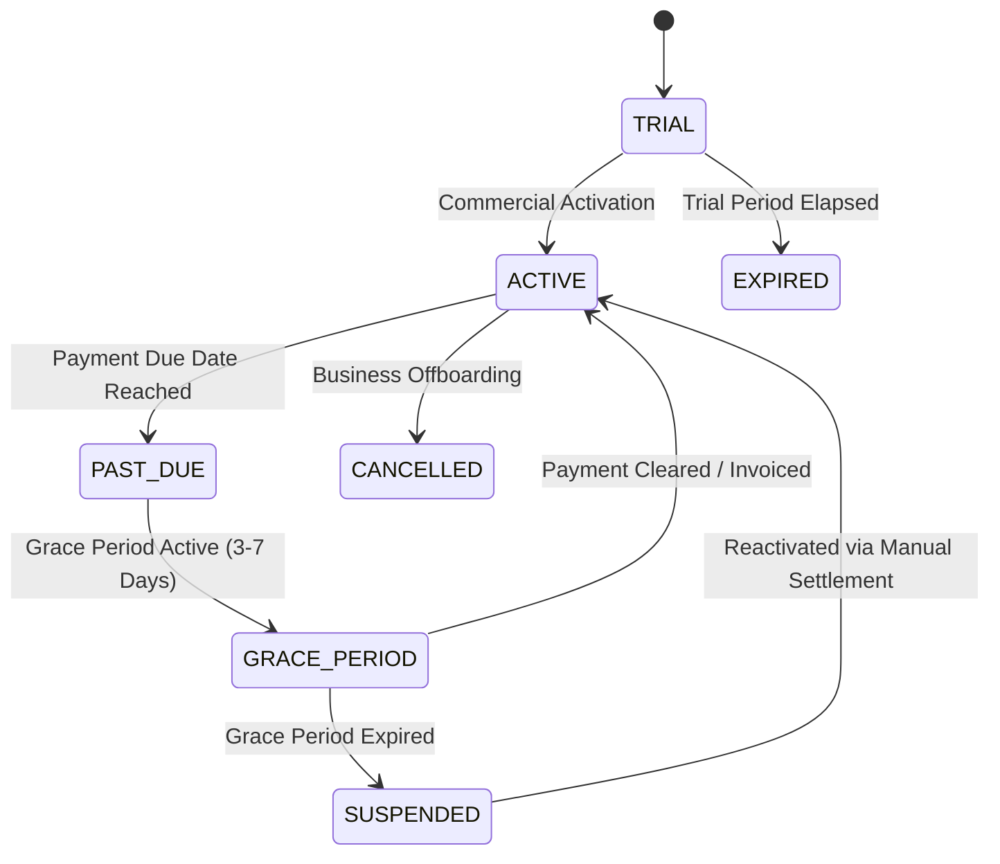

# PHASE 16 — SUBSCRIPTION & COMMERCIAL STATE MACHINE AUDIT
**Product:** Lumina Cyber Solution v1.0.0  
**Phase:** 16 — Final v1.0 Release & Commercial Launch Gate  
**Status:** AUDITED & PASS

---

## 1. Executive Summary
The subscription state machine governs commercial entitlements throughout customer lifecycles. It models commercial status cleanly separated from technical cryptographic license verification.

---

## 2. Tested Lifecycle State Transitions

| Lifecycle State | Feature Entitlements & Application Behavior | Audit Status |
|---|---|---|
| **`TRIAL`** | Full cyber café features enabled (limited to 14 days or trial terminal cap) | **PASS** |
| **`ACTIVE`** | All operational, POS, printing, and session features enabled | **PASS** |
| **`PAST_DUE`** | Soft banner alert presented to administrator; operations uninterrupted | **PASS** |
| **`GRACE_PERIOD`** | Warning banner on dashboard; operations functional for 7 days | **PASS** |
| **`SUSPENDED`** | Operational workstations locked; administrative & backup exports remain available | **PASS** |
| **`EXPIRED`** | POS sales disabled; read-only reporting and database backup allowed | **PASS** |
| **`CANCELLED`** | Account locked; tenant offboarding data export enabled | **PASS** |
| **`REACTIVATED`** | License and state machine restore full access immediately | **PASS** |

---

## 3. Tier Upgrades and Downgrades
- **Tier Upgrade:** Moving from *Starter* (5 PCs) to *Business* (20 PCs) applies immediately upon license re-signing without restarting database engine.
- **Tier Downgrade:** If current workstation count exceeds new tier limit, existing workstations are preserved in read-only/disabled state until operator adjusts active allocation.

---

## 4. Verification Evidence
- **Automated Test:** `tests/phase_16_release_verification.ts` -> `SUB-AUDIT-01`
- **Result:** PASS — Complete lifecycle state transitions and feature gate enforcements verified.
